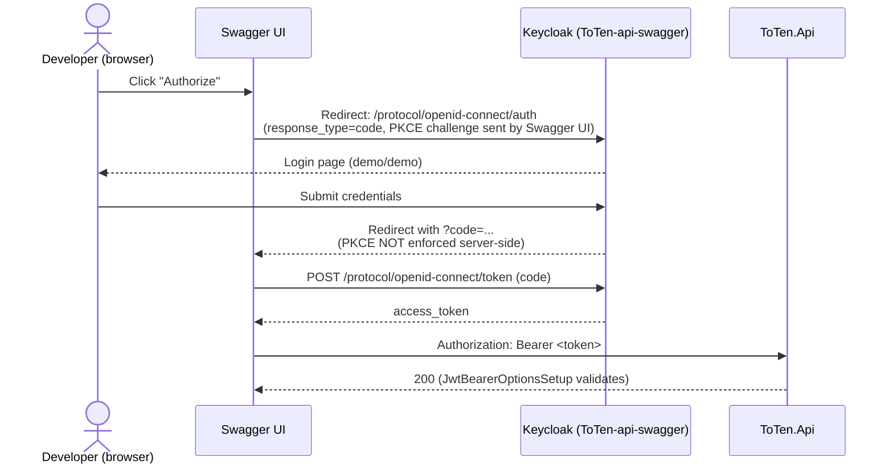
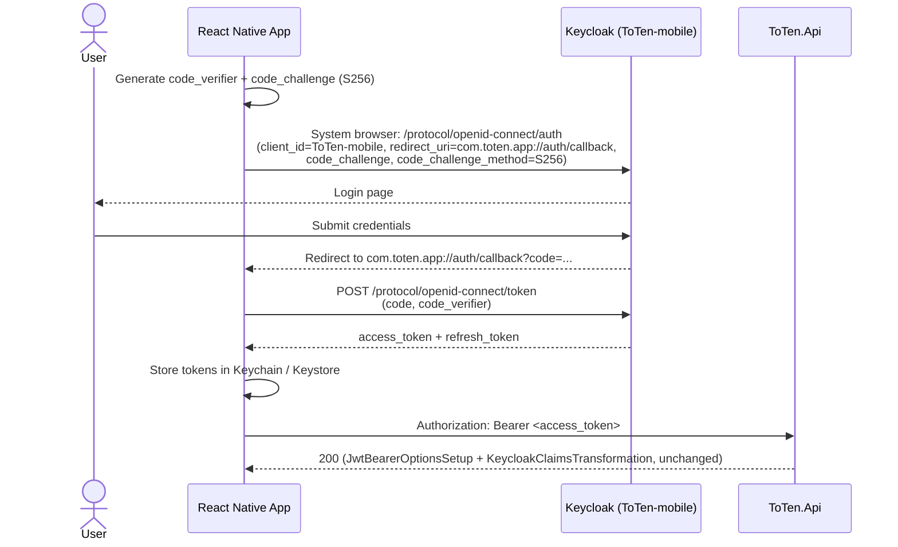
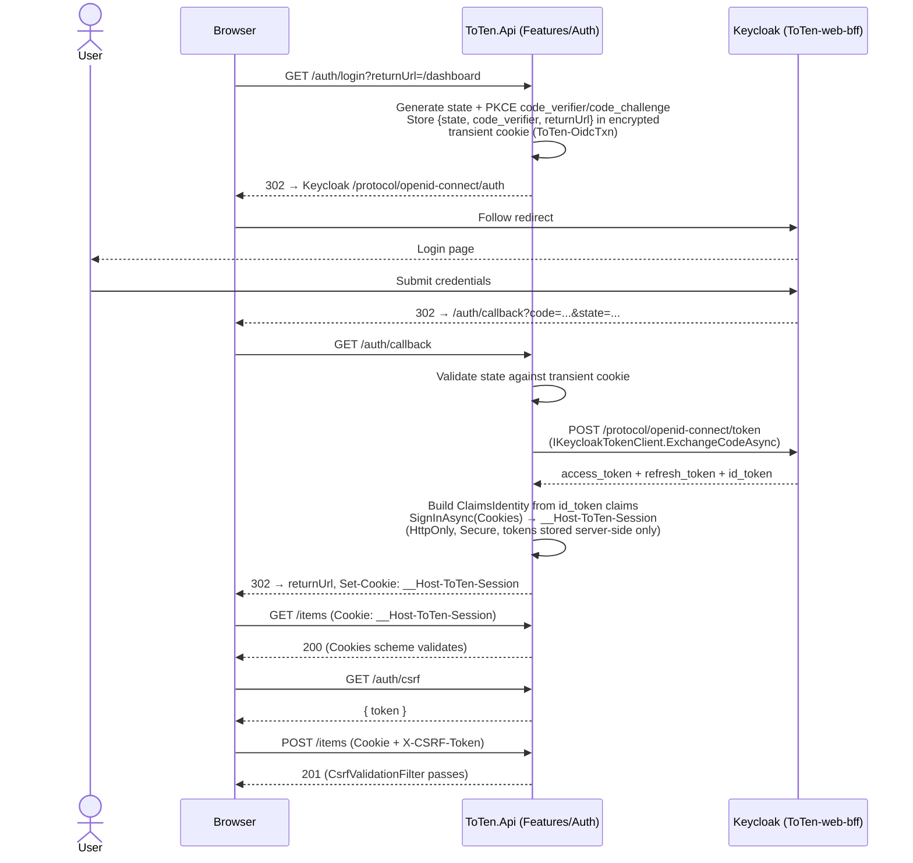

# Authentication Architecture

This document walks through ToTen's authentication design before and after resolving audit finding 1.8 ("No Keycloak client ready for a mobile app," see `docs/section-2-flagged-issues.md`), and gives the manual steps needed to pick up the change locally and in a deployed/reprovisioned environment.

## Before

Only one auth path existed anywhere in the system: the Swagger UI's own browser-side Authorization Code flow, run manually by a developer clicking "Authorize" in `/swagger`.



What was missing:
- **No mobile path at all.** `ToTen-api` — the only application-owned client — had every OAuth grant disabled (`standardFlowEnabled`, `implicitFlowEnabled`, `directAccessGrantsEnabled`, `serviceAccountsEnabled` all `false`) and a wildcard `redirectUris: ["/*"]`. No client in the realm could be used by a mobile app to obtain a token.
- **No web session path.** `ToTen.Api` had no login/callback/logout endpoint anywhere — a browser-based client had no way to establish a session short of embedding the same public-client PKCE flow Swagger UI uses, which would expose raw tokens to page JavaScript.
- **PKCE wasn't enforced.** Even the one client that did Authorization Code (`ToTen-api-swagger`) had no `pkce.code.challenge.method` attribute set — Keycloak accepted the flow whether or not a challenge was sent.

## Current architecture

Two new Keycloak clients back the two real client types, converging on the same request-validation pipeline `ToTen.Api` already had:

| Client | Flow | Tokens live | Keycloak client | Scheme in `ToTen.Api` |
|---|---|---|---|---|
| React Native mobile | Auth Code + PKCE (S256), native → Keycloak directly | Device secure storage (Keychain/Keystore) — app's responsibility, outside the API | `ToTen-mobile` (new, public) | `Bearer` (existing, unchanged) |
| Web frontend | Auth Code + PKCE (S256), BFF-brokered | Inside `ToTen.Api`'s encrypted session cookie only; browser never sees raw tokens | `ToTen-web-bff` (new, confidential) | `Cookies` (new) |
| Swagger UI (dev tool) | Auth Code + PKCE, browser → Keycloak directly (unchanged behavior) | Browser memory (Swagger UI's own) | `ToTen-api-swagger` (existing, now PKCE-enforced) | `Bearer` |
| `ToTen-api` (today) | none — resource identity only | n/a | `bearerOnly: true`, not deleted | n/a |

Both `Bearer` and `Cookies` are registered under a single default **"smart" policy scheme** (`Program.cs`) that inspects each request once: an `Authorization` header present forwards to `Bearer`, otherwise to `Cookies`. Every existing endpoint's `RequireAuthorization(...)`/`[Authorize(Policy = ...)]` call is unmodified — it evaluates against whichever principal the policy scheme forwarded to, and `KeycloakClaimsTransformation` flattens Keycloak's role claims the same way regardless of which scheme authenticated the request.

### Mobile: native PKCE, direct to Keycloak



`ToTen.Api` requires no code path specific to mobile beyond the realm client itself — bearer validation is identical to what already existed. This is why there's no dedicated "mobile login flow" integration test: the mobile app never calls anything under `/auth/*`, and every existing `CreateAuthenticatedClient`-based test already covers this path.

### Web: server-side BFF, cookie session



Raw Keycloak tokens never reach the browser — the session cookie is `HttpOnly`, so page JavaScript can't read it even if XSS'd. Mutating requests (`POST`/`PUT`/`PATCH`/`DELETE`) authenticated via the `Cookies` scheme require an `X-CSRF-Token` header, validated by `CsrfValidationFilter` (mobile's bearer callers are exempt — no ambient credential to forge). `CookieTokenRefreshEvents` transparently refreshes the stored access token via the refresh token as the 5-minute access-token lifespan approaches expiry, using the realm's `revokeRefreshToken: true`/`refreshTokenMaxReuse: 0` settings to hard-reject a stolen-and-reused refresh token.

## Manual setup — local development

1. **Rebuild the Keycloak container.** The realm is baked into the Keycloak image at container-build time (`docker/keycloak/Dockerfile.dev`), not live-imported — pulling this change alone does **not** update an already-running Keycloak container. Find and remove the existing persistent container so Aspire rebuilds it with the new `ToTen-mobile`/`ToTen-web-bff` clients:
   ```bash
   docker ps                  # find the Keycloak container ID
   docker rm -f <container-id>
   ```
2. **Confirm the dev secret matches.** `src/ToTen.AppHost/AppHost.cs`'s `ToTenWebBffClientSecret` parameter (`dev-web-bff-secret-change-me-9f8e7d6c5b4a`) must be identical to the literal `secret` field on `ToTen-web-bff` in `src/ToTen.AppHost/realms/ToTen-realm.json` — neither is regenerated automatically, so if you ever change one, change the other.
3. **Run the app:**
   ```bash
   dotnet run --project src/ToTen.AppHost
   # or: aspire run
   ```
4. **Verify the web BFF flow:** open `https://localhost:<api-port>/auth/login` in a browser, log in as `demo`/`demo`, and confirm you're redirected back with a `__Host-ToTen-Session` cookie set; `GET /auth/me` should return your claims.
5. **Swagger UI is unchanged behaviorally** — the "Authorize" button still works against `ToTen-api-swagger`, which is now additionally PKCE-enforced by Keycloak (Swagger UI already sent a PKCE challenge; Keycloak just wasn't requiring it before).

## Manual setup — production / reprovisioning resources

These steps are needed once per environment (fresh provision or full reprovision), not per deploy — the underlying values are stable once set.

1. **Generate a real `ToTen-web-bff` client secret** and set it in two places that must agree:
   - GitHub Actions secret `TF_VAR_KEYCLOAK_WEB_BFF_CLIENT_SECRET` — consumed by the `docker-build-push` job's `--build-arg KEYCLOAK_WEB_BFF_CLIENT_SECRET` (bakes the secret into the deployed Keycloak's realm import) and by the `terraform` job's `-var` (becomes the API's `Auth__WebBff__ClientSecret` via Key Vault → Container App secret).
   - If applying Terraform directly instead of via CI, also set `terraform/envs/secrets.tfvars`'s `keycloak_web_bff_client_secret`.
2. **Set the web BFF redirect URI** once the API's real Container App FQDN is known:
   - GitHub Actions **repository variable** (not a secret) `WEB_BFF_REDIRECT_URI` = `https://<api-fqdn>/auth/callback` — consumed by the same `docker-build-push` build-arg and by `terraform`'s `-var keycloak_web_bff_redirect_uri`.
   - Both must agree: one is baked into Keycloak's realm import, the other becomes `ToTen.Api`'s own `Auth__WebBff__RedirectUri` env var.
3. **Why this is a two-pass bootstrap on a fresh environment:** the API's FQDN isn't known until *after* the first `container-apps`/`apps` Terraform apply, so the very first Keycloak image build necessarily falls back to the dev placeholder redirect baked into `docker/keycloak/Dockerfile`'s `ARG` default. Once `WEB_BFF_REDIRECT_URI` is set:
   - Re-run (or manually re-trigger) the `docker-build-push` job so the Keycloak image is rebuilt with the real redirect URI, then
   - Re-run `terraform apply` (`./scripts/toten.sh apply`) so the API's env var and Keycloak's realm agree.
   This is a one-time step per environment, not per deploy — the ACA environment (and thus the FQDN) doesn't change on subsequent deploys.
4. **Verify after apply:**
   ```bash
   az keyvault secret list --vault-name <vault-name> --query "[].name"   # expect 7 secrets, incl. web-bff-client-secret
   az containerapp show --name <api-app-name> --query "properties.template.containers[0].env"
   ```
5. **Smoke tests:** `./scripts/toten.sh smoke-tests` validates `/openapi/v1.json` and the Keycloak realm as it already does today — it does not yet exercise `/auth/login`/`/auth/callback` end-to-end; extending it to do so is a future enhancement, not covered by this change.

## What didn't change

- `AuthOptions` (`Authority`/`Audience`/`ApiScope`) and bearer-token validation (`JwtBearerOptionsSetup`, `KeycloakClaimsTransformation`) are untouched.
- `AuthorizationConfiguration`'s six role policies (`UserPolicy`, `BusinessOwnerPolicy`, `InternalUserPolicy`, `AdminPolicy`, `SuperAdminPolicy`, `ThirdPartyPolicy`) work identically against both schemes.
- SignalR's `ChatHub` keeps its existing bearer/query-string-token pattern — extending it to accept the `Cookies` scheme was explicitly deferred (see `docs/section-2-flagged-issues.md`).
