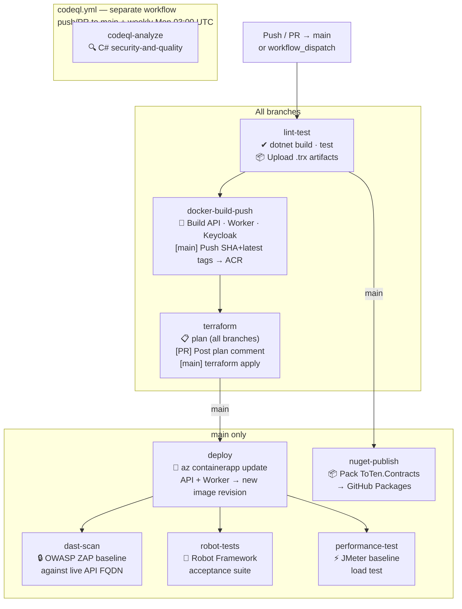
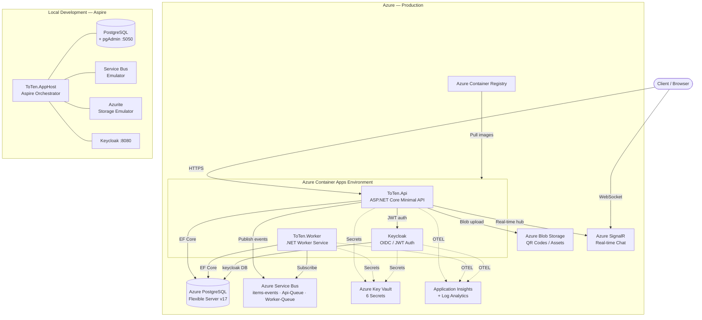

# ToTen
=======
# ToTen Backend .NET Template 
A comprehensive .NET 10 backend template using Aspire for local development and deployment to Azure. This **PRO version** extends the base template with advanced features including pub/sub messaging, worker services, and enhanced cloud-ready capabilities for production-grade applications.
Original template acquired from Julio Casal and further customized.

## Overview

This **PRO version** includes all the features of the base template plus:

### Core Features
- **.NET 10 Web API** with Entity Framework Core and PostgreSQL
- **Vertical Slice Architecture** with feature-based organization
- **Keycloak authentication** for JWT-based security
- **Global error handling** for consistent API responses
- **Aspire** orchestration for local development
- **Azure Container Apps** deployment ready
- **CI/CD pipeline** for GitHub Actions

### PRO Features
- **Pub/Sub messaging** with Azure Service Bus for item lifecycle notifications
- **Background worker service** for asynchronous message processing
- **Real-time chat** via Azure SignalR Service (`ChatHub`)
- **Production health checks** for comprehensive monitoring
- **Azure Application Insights** integration for enhanced telemetry
- **Integration tests** with test containers and messaging mocks
- **Acceptance tests** with Robot Framework (post-deploy)
- **Performance tests** with Apache JMeter (baseline load)
- **DAST** with OWASP ZAP (post-deploy security scan)
- **SAST** with CodeQL (C# security-and-quality, weekly + on push/PR)
- **Terraform IaC** (11 modules) replacing `azd` Bicep — manages all Azure resources
- **`toten.sh` CLI** for infrastructure lifecycle (bootstrap, plan, apply, destroy, smoke-tests)
- **GitHub Codespaces** support with pre-configured dev environment

## Prerequisites

Before getting started, ensure you have the following tools installed:

- **[.NET 10 SDK](https://dotnet.microsoft.com/download/dotnet/10.0)** - The latest .NET SDK
- **[Docker Desktop](https://www.docker.com/products/docker-desktop/)** - For containerized services (PostgreSQL, Keycloak)
- **[Aspire CLI](https://learn.microsoft.com/dotnet/aspire/cli/install)** - To run the application locally and deploy to Azure
- **[Azure Developer CLI (azd)](https://learn.microsoft.com/en-us/azure/developer/azure-developer-cli/install-azd)** - For CI/CD pipeline configuration

## Getting Started

### Running the Project Locally

1. **Navigate to the root directory** of the project
2. **Run the application** using Aspire:
   ```bash
   dotnet run --project src/ToTen.AppHost
   ```
   Or alternatively:
   ```bash
   aspire run
   ```

3. **Access the Aspire Dashboard** using the URL provided in the terminal output

### Testing the API

Once the application is running, you can test the API using:

- **Swagger UI**: Access it from the Aspire Dashboard by clicking the **API Docs** link for the API service
- **Aspire Dashboard**: Monitor application health, logs, and metrics through the dashboard

### Authentication with Keycloak

The template uses Keycloak for authentication. Once the application is running:

#### Testing API with Swagger UI

1. **Access Swagger UI** from the Aspire Dashboard by clicking the **API Docs** link
2. **Click the "Authorize" button** in the Swagger UI interface
3. **Complete the OAuth2 flow**:
   - You'll be redirected to the Keycloak login page
   - **Login with**: `demo` / `demo`
   - After successful authentication, you'll be redirected back to Swagger UI
4. **Test API endpoints**: You can now use all API endpoints in Swagger UI with the obtained access token

#### Managing Keycloak (Admin Access)

If you need to manage Keycloak realm, clients, scopes, or users:

1. **Access Keycloak Admin Console** from the Aspire Dashboard by clicking on the Keycloak service endpoint
2. **Login with admin credentials**:
   - **Username**: `admin`
   - **Password**: `admin`
3. From here you can:
   - Create additional users
   - Configure client scopes
   - Manage roles and permissions
   - Adjust authentication flows

#### Exporting Keycloak Realm

To export the Keycloak realm configuration (useful for backup or version control):

1. **Find the Keycloak volume name** assigned by Aspire:
   ```bash
   docker volume ls
   ```
   Look for a volume name similar to `ToTen.apphost-<hash>-keycloak-data`

2. **Stop the running Keycloak container** (if any):
   ```bash
   docker ps
   ```
   Find the Keycloak container ID, then stop it:
   ```bash
   docker stop <keycloak-container-id>
   ```

3. **Run the export command** (replace `<keycloak-volume-name>` with the actual volume name):
   ```bash
   docker run --rm -v <keycloak-volume-name>:/opt/keycloak/data -v "${PWD}\kc-export:/export" -e KC_DB=dev-file quay.io/keycloak/keycloak:26.4 export --realm ToTen --dir /export --users realm_file
   ```

4. The exported realm configuration will be saved to the `kc-export` directory in your project root

### Running Tests

To run the integration tests:

```bash
# Run all tests
dotnet test

# Run tests for a specific project
dotnet test tests/ToTen.Api.IntegrationTests
```

The integration tests use test containers and include authentication scenarios with the test auth handler.

## What's New & Better?

### Pub/Sub Messaging
This iteration adds comprehensive messaging capabilities:

- **Message Publishing**: API publishes messages when items are created, updated, or deleted
- **Worker Service**: Dedicated background service for processing messages
- **Azure Service Bus**: Production-ready messaging with local emulator support
- **Message Contracts**: Shared message definitions in a separate contracts library

### Production Health Checks
- **Extended health monitoring**: Comprehensive health checks for messaging services
- **Service dependencies**: Monitor database, Service Bus, and external service health
- **Custom health endpoints**: Ready and alive endpoints for container orchestration

### Enhanced Monitoring & Telemetry
- **Azure Application Insights**: Integrated telemetry and monitoring

### Enterprise Development Features
- **Integration Tests**: Comprehensive test suite with test containers and messaging mocks
- **GitHub Codespaces**: Pre-configured cloud development environment
- **Azure DevOps Pipelines**: Enterprise-grade CI/CD with multi-stage deployments

---

## Pub/Sub Messaging

The template demonstrates pub/sub messaging using Azure Service Bus:

- **Message Publishing**: API publishes item lifecycle messages (created, updated, deleted)
- **Message Processing**: Worker service processes messages for notifications, indexing, etc.
- **Local Development**: Uses Azure Service Bus emulator
- **Production**: Deploys with real Azure Service Bus namespace

### Testing Pub/Sub

1. Start the application with `dotnet run --project src/ToTen.AppHost`
2. Create/update items via the API (Swagger UI)
3. Watch the Worker logs in the Aspire Dashboard to see message processing

## Azure Deployment

### Deploy with Aspire

1. **Deploy to Azure**:
   ```bash
   aspire deploy
   ```

2. Follow the prompts to:
   - Select your Azure subscription
   - Choose a deployment region
   - Provide environment-specific configuration

The deployment will provision:
- Azure Container Apps Environment
- PostgreSQL Flexible Server
- Azure Service Bus namespace with queues
- Background Worker Container App
- Container Registry
- Application Insights workspace
- Managed Identity
- All necessary networking and security configurations

### Post-Deployment Configuration

After the deployment completes, you need to configure Keycloak for your Azure environment:

#### 1. Import the Realm Configuration

1. **Access your deployed Keycloak instance** using the URL provided in the Azure Container Apps
2. **Login to the Admin Console**:
   - **Username**: `admin`
   - **Password**: Check your Azure Key Vault or deployment outputs for the admin password
3. **Import the realm**:
   - Navigate to the realm dropdown in the top-left corner
   - Click **Create Realm**
   - Click **Browse** and select `src/ToTen.AppHost/realms/ToTen-realm.json`
   - Click **Create** to import the realm

### Testing the API with Postman

A Postman collection is included at [src/ToTen.Api/postman_collection.json](src/ToTen.Api/postman_collection.json) for testing the API, both locally and on Azure.

#### Setting up Postman

1. **Import the collection**:
   - Open Postman
   - Click **Import** and select `src/ToTen.Api/postman_collection.json`

2. **Configure collection variables**:
   - Right-click the imported collection and select **Edit**
   - Navigate to the **Variables** tab
   - For **local testing**, the default values should work (check the current values)
   - For **Azure testing**, update:
     - `baseUrl` with your deployed API endpoint (e.g., `https://your-api.azurecontainerapps.io`)
     - `keycloakUrl` with your deployed Keycloak endpoint (e.g., `https://your-keycloak.azurecontainerapps.io`)
   - Save the changes

3. **Authenticate for protected endpoints** (POST/PUT/DELETE requests):
   - Navigate to the collection's **Authorization** tab
   - Click **Get New Access Token** (OAuth 2.0 settings are pre-configured)
   - Sign in on the Keycloak page with **demo** / **demo**
   - Click **Use Token** to apply it to your requests

You can now send requests to test your deployed API!

## CI/CD Pipelines

The project ships two GitHub Actions workflows in `.github/workflows/`.

### CI/CD Flow



### Required Secrets & Variables

| Name | Type | Used by |
|---|---|---|
| `AZURE_CLIENT_ID` | Variable | OIDC login (all Azure jobs) |
| `AZURE_TENANT_ID` | Variable | OIDC login |
| `AZURE_SUBSCRIPTION_ID` | Variable | OIDC login |
| `ACR_NAME` | Variable | Image tag construction |
| `TF_VAR_POSTGRES_ADMIN_PASSWORD` | Secret | Terraform apply |
| `TF_VAR_KEYCLOAK_ADMIN_PASSWORD` | Secret | Terraform apply |
| `ROBOT_API_KEY` | Secret | Robot Framework acceptance tests |
| `GITHUB_TOKEN` | Auto | NuGet publish to GitHub Packages |

### Infrastructure as Code

Terraform (`terraform/`) manages all Azure resources. Use `./scripts/toten.sh` for lifecycle operations:

```bash
./scripts/toten.sh bootstrap   # one-time setup (providers, TF state storage, Entra app)
./scripts/toten.sh plan        # review changes before applying
./scripts/toten.sh apply       # provision / update infrastructure
./scripts/toten.sh smoke-tests # validate the live API and Keycloak after deploy
```

## GitHub Codespaces

This template is configured for GitHub Codespaces with a dev container:

### Creating a Codespace

1. **Navigate to your GitHub repository**
2. **Click the "Code" button** and select "Codespaces"
3. **Click "Create codespace on main"**

The dev container will automatically:
- Install .NET 9 SDK
- Install the Aspire CLI
- Configure the development environment
- Expose necessary ports for the application

### Working in Codespaces

Once your codespace is ready:
- Run `aspire run` to start the application
- Access the Aspire Dashboard through the forwarded ports
- All development tools and extensions are pre-configured

## Project Structure

```
├── src/
│   ├── ToTen.Api/              # ASP.NET Core Minimal API (Vertical Slice Architecture)
│   │   ├── Features/           # 9 domains: Categories, Communications, Items, Manifests,
│   │   │                       #   Marketplace, Memberships, Organizations, Storage, Users
│   │   ├── Data/               # EF Core DbContext and configurations
│   │   └── Shared/             # Auth, CORS, error handling, messaging, identity abstractions
│   ├── ToTen.AppHost/          # Aspire orchestrator (local dev wiring)
│   ├── ToTen.Contracts/        # Shared message event contracts (ItemEvents.cs)
│   ├── ToTen.Worker/           # .NET Worker Service — 3 Rebus message consumers
│   └── ToTen.ServiceDefaults/  # Shared Aspire defaults (OTEL, resilience, health checks)
├── terraform/                  # Terraform IaC — 11 Azure modules
│   ├── modules/                # observability, container-apps, postgres, service-bus,
│   │                           #   storage, registry, signalr, key-vault, keycloak, apps
│   └── envs/                   # prod.tfvars, secrets.tfvars (gitignored)
├── scripts/
│   └── toten.sh                # Infrastructure lifecycle CLI (bootstrap/plan/apply/destroy)
├── tests/
│   ├── ToTen.Api.IntegrationTests/   # WebApplicationFactory + Testcontainers tests
│   ├── ToTen.AcceptanceTests/        # Robot Framework acceptance suite
│   └── performance/                  # JMeter baseline load tests
├── docker/                     # Dockerfiles for api/, worker/, keycloak/
├── .adal/                      # AI agent specs and skills (architect, backend, devsecops, qa)
├── .azdo/                      # Azure DevOps pipeline configuration
├── .github/workflows/          # GitHub Actions: azure-dev.yml, codeql.yml
├── .devcontainer/              # Dev container configuration
└── azure.yaml                  # Azure Developer CLI configuration
```

## Architecture

This template follows **Vertical Slice Architecture** principles, organizing code by features rather than technical layers.

### System Architecture



### Feature Organization

Each feature (like `Items` or `Categories`) in the `Features/` folder contains:

- **Feature Endpoints** - A main endpoints class that groups and maps all related routes
- **Individual Operations** - Each operation (GetItems, CreateItem, UpdateItem, etc.) has its own folder containing:
  - **Endpoint** - The minimal API endpoint definition with all business logic inline
  - **DTOs** - Request/response models specific to that operation

### Example Structure

```
Features/
├── Items/
│   ├── ItemsEndpoints.cs           # Groups all item-related endpoints
│   ├── Constants/                  # Shared constants for the feature
│   ├── CreateItem/
│   │   ├── CreateItemEndpoint.cs   # POST endpoint with business logic
│   │   └── CreateItemDtos.cs       # Request/response DTOs
│   ├── GetItems/
│   │   ├── GetItemsEndpoint.cs     # GET collection endpoint
│   │   └── GetItemsDtos.cs         # DTOs for pagination and filtering
│   └── GetItem/
│       ├── GetItemEndpoint.cs      # GET single item endpoint
│       └── GetItemDtos.cs          # Single item response DTOs
```

### Key Principles

This approach promotes:
- **Self-contained operations** - Each endpoint contains its complete logic flow
- **Feature cohesion** - All related operations are grouped together
- **Minimal dependencies** - Each operation only depends on what it needs
- **Easy testing** - Individual operations can be tested in isolation
- **Simple maintenance** - Changes to one operation don't affect others

## Installing the Template

To use this template for creating new projects:

1. **Navigate to the template root directory**
2. **Install the template**:
   ```bash
   dotnet new install .\
   ```

### Using the Template

Once installed, create a new project using the template:

```bash
# Create a new project in the current directory
dotnet new toten-backend

# Create a new project with a specific name
dotnet new toten-backend -n MyAwesomeBackend
```

### Template Parameters

The template supports the following parameters:

- `-n|--name`: Name of the project (default: current directory name)


## Configuration

### Local Development

The template uses Keycloak for local authentication. Configuration is handled automatically through Aspire service discovery.

**Key features enabled for local development:**
- **Global error handling** - Consistent error responses across all endpoints
- **CORS configuration** - Properly configured for local development
- **Health checks** - Built-in health monitoring endpoints
- **Logging and telemetry** - Integrated with Aspire dashboard

### Production

In production (Azure), the following are automatically configured:
- Managed Identity for secure service-to-service communication
- Azure Database for PostgreSQL
- Container Apps for scalable hosting
- Azure Service Bus for reliable messaging
- Application Insights for monitoring and telemetry
- Automatic scaling based on message queue depth and HTTP traffic


## License

This PRO template is provided as-is for educational and development purposes.
